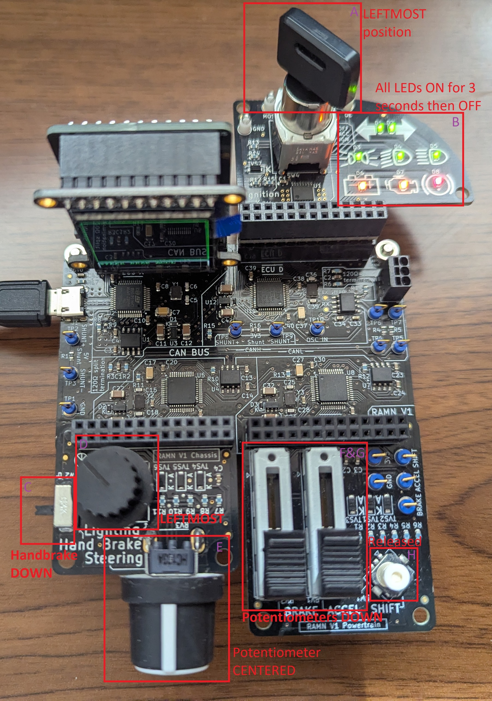
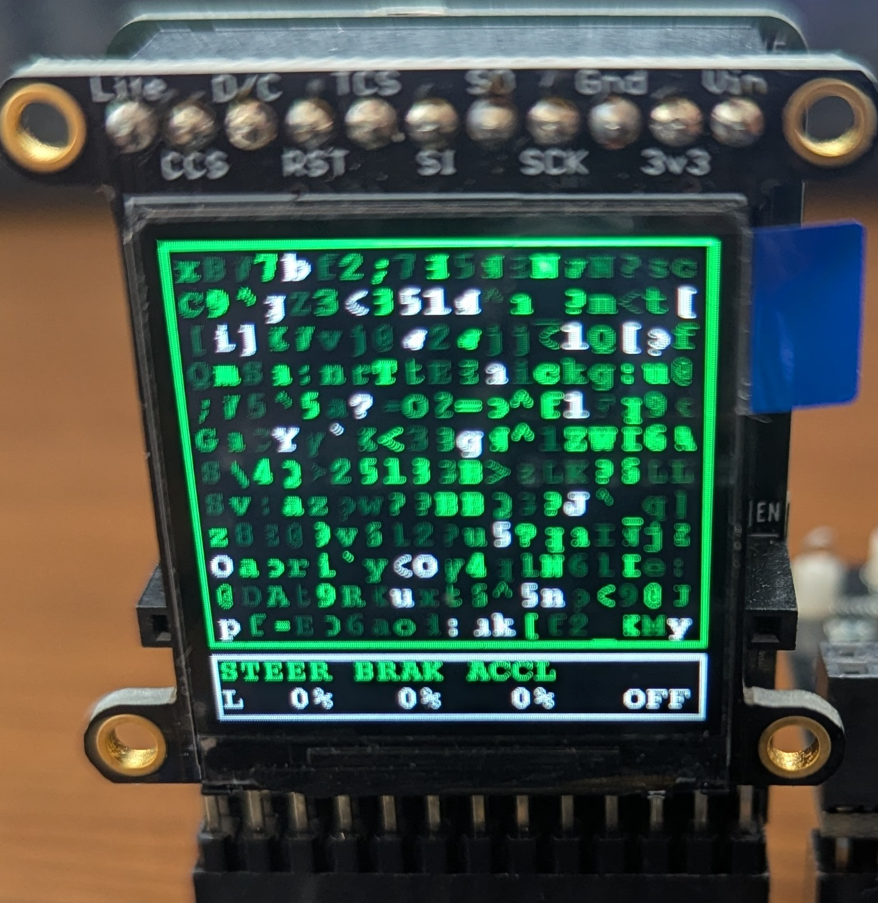
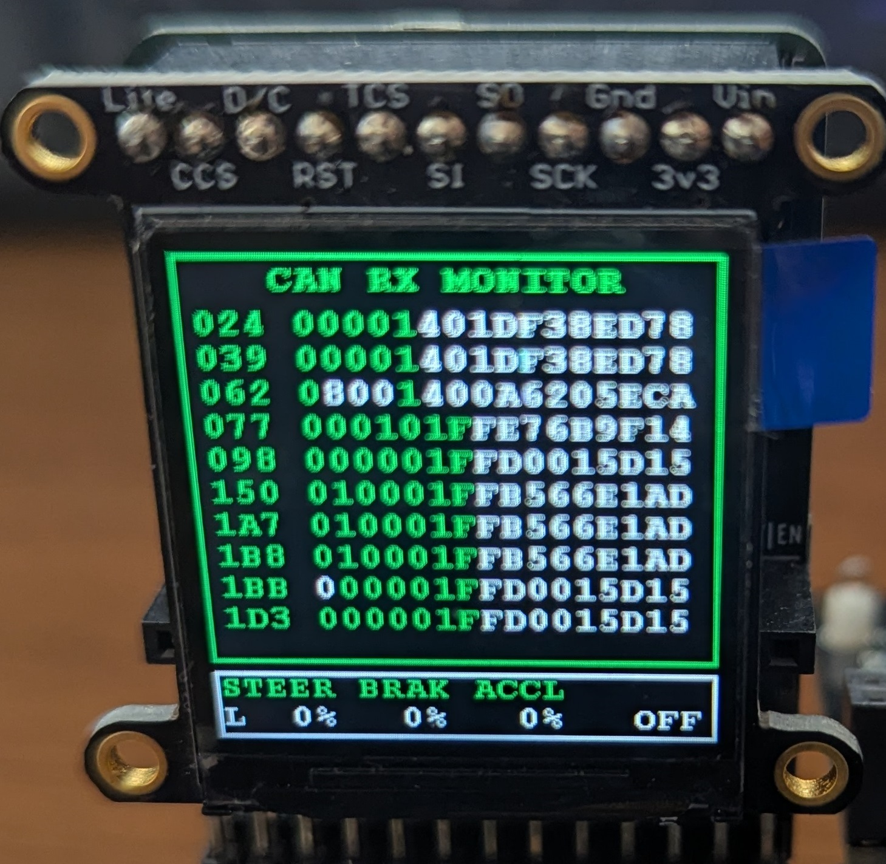

.. _qualitycheck:

Quality Check
=============

This page describes a procedure to verify that a board is correctly flashed and functional.
If you encounter an issue at any of the steps below, refer to the :ref:`quality_troubleshooting` section.

Before starting, make sure that you have flashed the board with the latest firmware following the :ref:`flashing_scripts` instructions.

Procedure
---------

Step 1: Assemble and verify LED status after boot
#################################################

Make sure that the board is assembled as shown in the picture below. **Position all actuators as shown in the picture (neutral position).**
Unplug the USB cable, then replug it to power up the board. **Make sure that ALL LEDs (in B square) light up for about three seconds, then all turn off.**

   
Step 2: Verify data on screen
#############################

ECU A's screen can be used to check the status of each actuator. 
**Verify that the bottom of the screen shows the same data as the picture below**. Screen color is random, and may be different at each power cycle.
"STEER" shows the status of the steering potentiometer (in E square), L for Left and R for Right. When centered, it should be between "L 5%" and "R 5%". 

   
Step 3: Verify CAN bus traffic
##############################
   
**Press the SHIFT joystick (in H square) to the right, then release it. Verify that LED D2 (in B square) is now blinking. Verify that the screen now shows similar data as the picture below.**
The main screen should be filled with letters and numbers.
   

   
Step 4: Test the handbrake
##########################

Move the Handbrake (in C Square) up. Verify that the bottom of the screen now shows "SB".

Step 5: Test the headlights
###########################

Move the headlights switch (in D square) from the leftmost position to the rightmost position. When moving the switch between positions, the bottom of the screen should show "CL", "LB", then "HB".

.. warning::

	If the screen shows something else, then it is possible that your switch was soldered with the **wrong orientiation**. Refer to the picture above for the correct orientation when the switch is at the leftmost position.

Step 6: Test Chassis
####################

Move the chassis potentiometer (in E square) to the leftmost position and verify that "STEER" now shows "L100%". Move it to the rightmost position and verify that it shows "R100%".

Step 7: Test brake and accelerator
##################################

Move the brake and accelerator potentiometers (in F&G square) all the way up. Verify that the screen now shows "98%" (or a value above 95%) for brake "BRAK" and "ACCL".

Step 8: Test the engine key
###########################

Move the engine key (in A square) from left, to middle, to center. Verify that the text at the bottom-right of the screen goes from "OFF" to "ACC" to "IGN".
  
Step 9: Test SHIFT joystick
###########################

The SHIFT joystick has 5 positions (excluding the released state): Left-pressed, Right-pressed, Up-pressed, Down-pressed, and Center-pressed.

**Hold each of these positions and verify that the bottom of the screen respectively shows "LT", "RT", "UP", "DW", and "MD".**
(When using left/right, you will move between screens. If you end up on a screen that has no bottom text, try moving to another screen).

Step 10: Verify J1939 CAN Traffic (J1939 Mode Only)
###################################################

If your board has been flashed with the ``ENABLE_J1939_MODE`` compile-time switch active, the standard RAMN CAN matrix is replaced by an SAE J1939-compliant Multi-Controller Application architecture. To test this mode, connect a CAN adapter (e.g., PCAN, Kvaser, or a generic socketCAN device) to the CAN-H/CAN-L pins. Ensure your sniffing software is configured to decode 29-bit Extended CAN IDs.

Operate the physical controls and verify the corresponding J1939 PGNs and payloads:

* **Engine Key:**
  Move the engine key. 
  - **Ignition Switch:** Observe **PGN 0xFDC0** (64960), Source Address 0x4D (77). **CAN ID to inspect: 0x18FDC04D**. Byte 1 (bits 1-2, SPN 1637) should reflect the switch state (0=OFF, 1=ACC, 2=IGN).
  - **Run Switch Status (Battery LED):** Observe **PGN 0xFDC0** (64960), Source Address 0x21 (33). **CAN ID to inspect: 0x18FDC021**. Byte 3 (bits 3-4, SPN 3046) should reflect the "Battery" LED state (0=Off, 1=On/Run).

* **Steering (Chassis Potentiometer):**
  Turn the steering potentiometer left and right. Observe the Control Status on **ESC1 (PGN 0xF00B** / 61451), Source Address 0x13 (19). **CAN ID to inspect: 0x18F00B13**. Bytes 1-2 (SPN 2928) will sweep through the mapped angle range. *(Note: The Proprietary A Command message is an external request and will not change via the physical knob).*

* **Brake Pedal:**
  Move the brake potentiometer up and down. Observe the Control Status on **EBC1 (PGN 0xF001** / 61441), Source Address 0x21 (33). **CAN ID to inspect: 0x18F00121**. Byte 2 (SPN 521) should vary between 0% and 100% position. *(Note: The XBR Command is an external autonomous request).*

* **Accelerator Pedal:**
  Move the accelerator potentiometer up and down. Observe the Control Status on **EEC2 (PGN 0xF003** / 61443), Source Address 0x21 (33). **CAN ID to inspect: 0x18F00321**. Byte 2 (SPN 91) should vary between 0% and 100% position. *(Note: The TSC1 Command is an external autonomous request).*

* **Shift Joystick:**
  Move the SHIFT joystick (Up/Down/Left/Right/Press). Observe the Control Status on **ETC2 (PGN 0xF005** / 61445), Source Address 0x03 (3). **CAN ID to inspect: 0x18F00503**. Verify that Byte 4 (SPN 523, Current Gear) and Byte 5 (SPN 162, Requested Range) update according to the joystick position. *(Note: The TC1 Command is an external autonomous request).*

* **Handbrake (Sidebrake):**
  Toggle the Handbrake up and down. 
  - **Brake Switch Status:** Observe **EBS1 (PGN 0x0200** / 512), Source Address 0x0B (11). **CAN ID to inspect: 0x1802FF0B** (Broadcast DA=255). Byte 1 (bits 1-2, SPN 619) should reflect the active and inactive states.
  - **Parking Brake Switch (Parking LED):** Observe **CCVS1 (PGN 0xFEF1** / 65265), Source Address 0x21 (33). **CAN ID to inspect: 0x18FEF121**. Byte 4 (bits 3-4, SPN 70) should reflect the "Parking" LED state (0=Passive, 1=Active).

* **Headlights Switch:**
  Toggle the headlights switch through its four positions. 
  - **Control Status:** Observe **OEL (PGN 0xFDCC** / 64972), Source Address 0x21 (33). **CAN ID to inspect: 0x18FDCC21**. Byte 1 (bits 1-4, SPN 2872) should reflect the switch status (0=Off, 1=Park, 2=Lowbeam, 3=Highbeam).
  - **Simulator Command:** Observe **Lighting Cmd (PGN 0xFE41** / 65089), Source Address 0x05 (5). **CAN ID to inspect: 0x0CFE4105**.
  - **Engine Malfunction Indicator (Engine LED):** Observe **DM1 (PGN 0xFE4A** / 65226), Source Address 0x21 (33). **CAN ID to inspect: 0x18FE4A21**. Byte 1 (bits 7-8, SPN 1213) should reflect the "Engine" LED state (0=Disabled, 1=Enabled).

* **Turn Indicators:**
  Press the SHIFT joystick left and right.
  - **Indicator Request:** Observe **OEL (PGN 0xFDCC** / 64972), Source Address 0x05 (5). **CAN ID to inspect: 0x0CFDCC05**. Byte 2 (bits 1-4, SPN 2876) should reflect the request (1=Left, 2=Right, 3=Hazard).
  - **Blinking Status:** Observe **OEL (PGN 0xFDCC** / 64972), Source Address 0x21 (33). **CAN ID to inspect: 0x18FDCC21**. Byte 2 (bits 1-4, SPN 2876) will toggle between the active side and 0 (Not Active) at the blinking frequency.

All unused bytes in the 8-byte J1939 payloads should remain set to ``0xFF`` (Not Available).
  
   
.. _quality_troubleshooting:

Troubleshooting
---------------

If the steering potentiometer does not show 0% when centered, you may have flashed the wrong firmware (see :ref:`flashing`).
You can fix this problem by flashing ECU B with the alternative firmware (most likely, linear in place of logarithmic).

If actuators are responsive but show erroneous values (for example, the screen shows "UP" when you press the SHIFT joystick down), your board may require calibration. 
Please contact us for assistance.

Make sure to remove external CAN adapters, if present.

If you fail at any of the steps above, it may be because of an improperly flashed board. 
Reflash the board following the :ref:`flashing_scripts` instructions.
If possible, also verify the option bytes (see section :ref:`verify_option_bytes`).
When correctly flashed, the board should show up as a serial device (COM port on Windows, /dev/ttyACMx on Linux), not as a "DFU in FS mode" device or a power-only device.

If you are certain that the board is correctly flashed, then you may have faulty connections (which you can identify by visual inspection) or a faulty component (which you should try to resolder, or replace).
Feel free to contact us for assistance.

